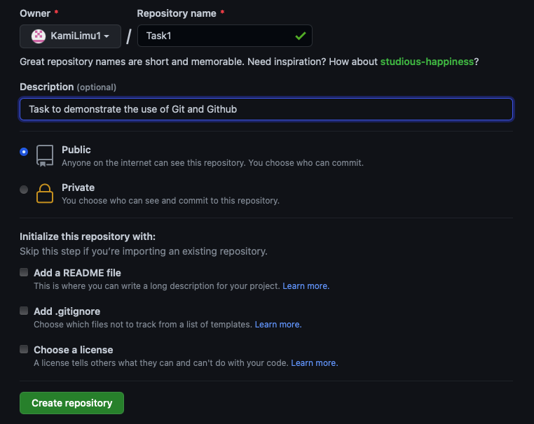
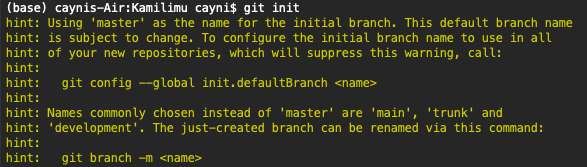
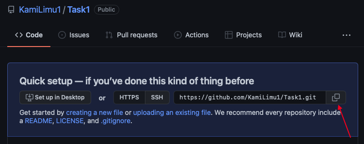
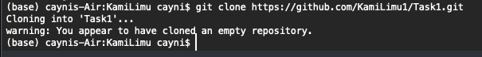
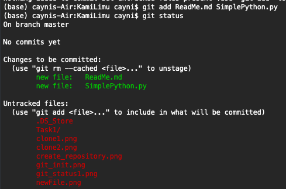
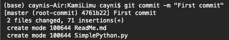
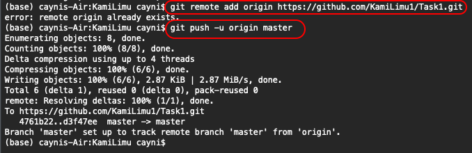
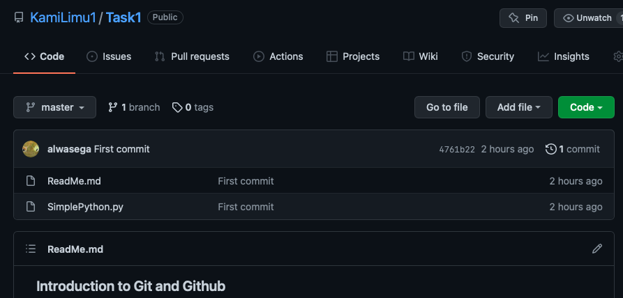
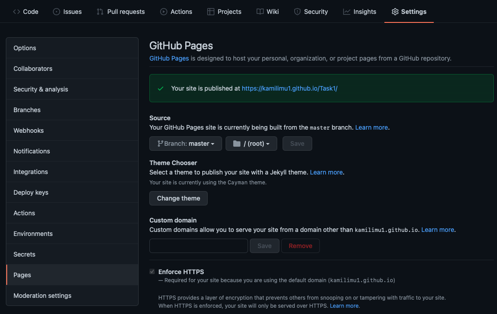
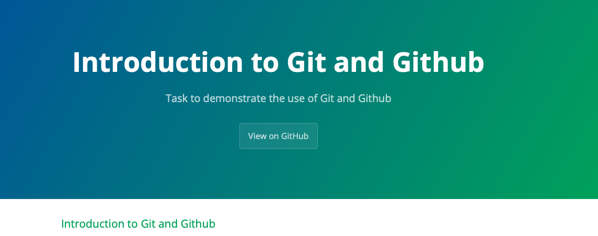

### Introduction to Git and Github

#### 1. Introduction

Git is an important toolkit to have as a tech student and practitioner. While they sound the same, Git and Github are two different, but interelated, technologies. This guide covers how to set up and use Git and Github. It is meant to serve first-time users of both; however, seasoned users are free to read through and raise an issue if you find any. 

While there are various ways of interacting with Git and Github, such as Github desktop, this guide will use the terminal/ Windows Command Prompt, not to make your life hard, but because it is important to learn the findamentals first. 

Happy reading and practicing! 

##### What is Git?

[To do]

##### What is Github?

[To do]

#### 2. Getting Started

##### Setting up Github

Head over to [Github](https://github.com) to create a Github account (if you do not yet have one) or log in. Next, create a repository that will house your work. A *repository* (fancy people will call it repo:) ) is the directory or storage space in which your project/ files live. It can be local to a folder on your computer, or it can be a storage space on GitHub or another online host. You can keep code files, text files, or image files inside a repository.



---
***IMPORTANT***

As in the screenshot above, do not select ```Add a README file``` while creating your repository. While this is a form of documentation that contains information about the other files in your repository or even what the repository aims to achieve, in this case, I have left it unselected as I (and you later) will be creating a ReadMe locally.

---

##### Setting up Git

Create a folder in your local machine and name it as suits you. Open your CMD/ terminal and move into this folder (You achieve this using the ```cd ``` command).

Next, on your terminal, run:

```
git init 
```
This will initialize (start) git inside the folder (repository) in which you are working. 
The result will look something like this: 



Most other Git commands are not available outside of an initialized repository, so this is usually the first command you'll run in a new project.

---
**NOTE**

The ```git init``` command creates a new Git repository. It can also be used to convert an existing project to a Git repository (which is what we have done above) or initialize a new, empty repository.

---

#### 3. Getting our hands dirty

##### Clone the repository you created on Github


```Clone``` means to create copy the repository in Github (the remote repository) so that you can work on it from your local machine. 

The **clone** operation is done using the ```git clone``` command line utility in Git. 


1. To create a clone of your remote repository (the one on Github), head over to the repository and copy the link given under ```Quick setup``` as shown below:



2. Head over to your terminal and enter: 

```
git clone + (copied link)
```



> Ignore the warning because we did not create any file within the remote repository while creating it.

##### Create a file locally and store it remotely

1. Using your favorite code editor (I am using SublimeText, for example), create a file and, in it, write a piece of code in a programming language of your choice. 

2. Use Git to ```push``` this file from your local to remote repository

```Pushing``` is how you transfer your local files, and any changes they contain, to a remote repository. This is done using the ```git push``` command. However, reign in on your excitement because there are a few checks to be done first before we can do the ultimate push. 

> Do a ```git status.```

This command allows you to check the state of your current working directory. Through it, you can check which changes have been staged and the files that are not being tracked by Git. 

For example, in the image below, none of my files in the folder in which I am working is being tracked by Git. Running ```git status``` also shows you what branch you are on. We will cover branches and how to navigate them later. However, note that, in this case, we are on ```master```, which is the default branch on Git. 

> Add the file you created to the staging area using ```git add```
The staging area is like a rough draft space, where you can add and remove versions of file before transferring them to the remote repository. 

What ```git add``` command does is to copy this file (or a version of it) from your working directory to the staging area. 

---
**IMPORTANT**

```git add``` can take one of two arguments. 

- **git add .** to add all the files in your directory to the staging area, or

- **git add <file name>** to add a file by its name to the staging area. 

---

In my case, I want to push both the ReadMe.md and SimplePython.py files. When I run ```git status``` again, the two files have been added to the staging area and the rest are untouched.  



---
**NOTE**

At this point, you can remove a file from the staging area using the ```git rm --cached <file>``` command. 

Try it out to unstage the file you added then stage it again to proceed. 

 ---

> From here, we can now push the files to our remote repository. 
Typically, this is a two-stage process that proceeds as follows: 

- **First**, we ```commit``` the changes using the command ```git commit -m "message" ```
A **commit** is simply your way of capturing a snapshot of the current changes that you have made to your local repository. Once you perform a commit, Git will never change the captured snapshot unless you ask it to. Note that commits are done locally and, at this stage, no changes have been made to the remote repository yet. 

For example, below, I will commit the two files with the message *First commit*



The ```-m``` flag tells git to create the commit with the given message. Other options are available: 
 	- ```git commit```: Commit the staged snapshot. This will launch a text editor prompting you for a commit message. After you’ve entered a message, save the file and close the editor to create the actual commit.
	- ```git commit -a```: Commit a snapshot of all changes in the working directory. This only includes modifications to tracked files (those that have been added with git add at some point in their history)
	- ```git commit am "commit message"```: A power user shortcut command that combines the -a and -m options. This combination immediately creates a commit of all the staged changes and takes an inline commit message.

---
**NOTE**

A **git commit** to the local directory can be reversed. This can be achieved using the ```git reset --soft head~1``` command. This directive will remove the last commit from the current branch, but the file changes will stay in your directory. You will still need to unstage it if you want to do so. 

---

- **Second**, following a successful commit, we then ```push``` the files/ changes to the remote repository. 



Indeed, on checking the Github repository, we see the two files have been successfully added. 



> 
---
***NOTE*** 

When you run ```git remote add origin <URL>```, Github will ask for a password to authenticate yourself. However, note that Github no longer accepts passwords as a form of authentication. Instead, you have to provide a Personal Auccess Token, which can be set and copied from ***```Settings>>Developer Settings>>Personal access tokens>>Generate new token ```***
	
Before this, you might need to run ```git remote set-url origin https://username@github.com/username/repo_name.git``` to point to the remote URL you want to change.

---

#### 4. One Step Further: Adding the ReadMe to Github Pages 

Now that we have hosted our files on Github, it is time to share it with others. This is where ```Github pages``` comes in handy: it allows you to create websites for yourself and your projects and is hosted directly from your repositories (that is how you are seeing this guide and instructions!). You can learn more about Github pages [here.](https://pages.github.com)

For this guide, however, we will create a simple page that displays the content of the ReadMe file. 

- Head over to your Github repository you created and pushed files to. 
- Click on ```Settings``` and then ```Pages```. 
- Change the source branch as ```Master``` and choose ```Cayman``` for your site's theme. You can play with the other themes too, although some will require further customizations to render your work. 
- Click on ```Save``` and wait for a link to your page to be generated. In my case it is ```https://kamilimu1.github.io/Task1/```


- My page looks like this: 




#### 5. Your Turn + Assignment

It is now your turn to follow this guide and create and share a ReadMe file on your Github account. 

- For practice, try to recreate every step I have done above, including creating and pushing a file with some code to your remote Github repository. 

- **FOR THE PEER MENTORSHIP TASK:** 

You will note that the Introduction section of this guide is incomplete. I have left the ***What is Git/ Github*** sections undone for a reason. 

1. Your first task: 
Research and write briefly about these two technologies on your own ReadMe file. 

2. On the same ReadMe for (1) above, create a guide on any technology/ programming language concept that interests you. For example, you might decide to write about inheritance in Java or the fundamentals of HTML/ CSS. Whatever you decide to work on and its length is up to you. The only deliverable is a Github Page containing the above two incomplete parts followed by your guide. Incorporate as many screenshots as you wish. 

All the best!

---
***IMPORTANT***

As always, collaboration and not being afraid to ask for help when stuck are key. 

---